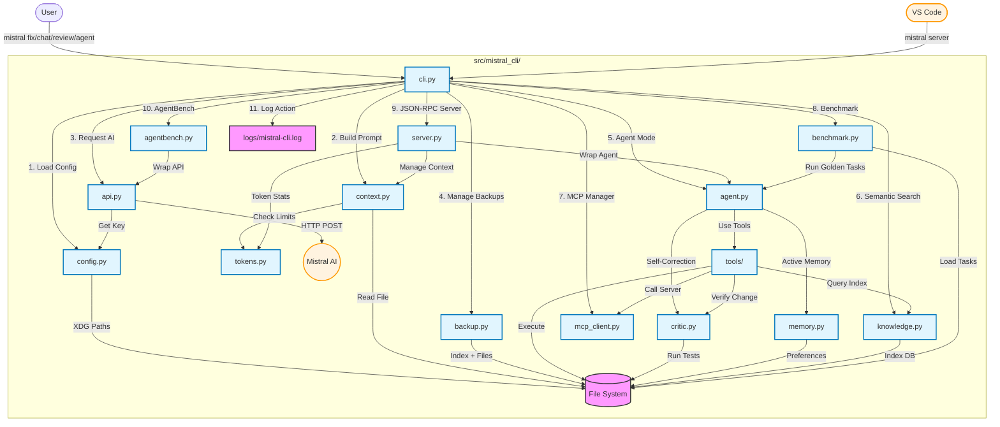

# Mistral CLI - Codebase Walkthrough

This document provides a detailed explanation of the `mistral-cli` codebase, breaking down each component to help you understand how the tool works.

## Architecture Overview



## Project Structure

```
mistral-cli/
├── src/
│   └── mistral_cli/
│       ├── __init__.py      # Package init + __version__
│       ├── cli.py           # CLI entry point (Click commands, chat/agent REPL)
│       ├── api.py           # Mistral API HTTP client (with tool calling support)
│       ├── config.py        # Global configuration (XDG paths, profiles, MCP)
│       ├── context.py       # Prompt building + ConversationContext + Planning
│       ├── tokens.py        # Token counting utilities
│       ├── backup.py        # Backup indexing for undo support
│       ├── agent.py         # Agentic loop with planning + MCP support
│       ├── knowledge.py     # Semantic search + codebase indexing (NEW v0.5)
│       ├── mcp_client.py    # MCP server client + manager (NEW v0.5)
│       ├── memory.py        # Active Memory "Hippocampus" (NEW v0.6)
│       ├── critic.py        # Autonomous Verification "Critic" (NEW v0.8)
│       ├── benchmark.py     # Golden Tasks Runner (NEW v0.8)
│       ├── server.py        # JSON-RPC server for VS Code extension (NEW v0.9)
│       └── tools/           # Tool implementations
│           ├── __init__.py  # Tool registry
│           ├── base.py      # Tool ABC + ToolResult + MCPToolWrapper
│           ├── files.py     # ReadFile, WriteFile, EditFile, ListFiles
│           ├── project.py   # SearchFiles, ProjectContext
│           ├── semantic.py  # SemanticSearchTool (NEW v0.5)
│           ├── memory.py    # UpdateMemoryTool (NEW v0.6)
│           ├── critic.py    # CriticTool (NEW v0.8)
│           └── shell.py     # ShellTool (SmartShellLogic v0.8)
├── tests/
│   ├── __init__.py
│   ├── test_cli.py          # CLI tests
│   ├── test_tools.py        # Tool unit tests
│   ├── test_agent.py        # Agent loop tests
│   └── golden_tasks.json    # Benchmark dataset (100 tasks)
├── planning/
│   ├── agentic_cli_roadmap.md   # Agentic feature roadmap
│   ├── codebase_walkthrough.md  # This file
│   └── testing-checklist.md     # Feature testing checklist
├── pyproject.toml           # Package configuration (PEP 621)
├── requirements.txt         # Dependencies
└── .pre-commit-config.yaml  # Code quality hooks
```

## Module Breakdown

### 1. Entry Point: `cli.py`

The CLI uses **Click** for command parsing and **Rich** for terminal output.

**Commands:**
- `mistral fix <file> <description>` - One-shot bug fixing with streaming
- `mistral review <file>` - Code quality review without modifications
- `mistral chat` - Interactive chat mode
- `mistral agent` - Agentic mode with tool execution and planning
- `mistral index [path]` - Index codebase for semantic search (NEW v0.5)
- `mistral mcp list|add|remove|test` - Manage MCP servers (NEW v0.5)
- `mistral watch <command>` - Watch mode for auto-fixing (NEW v0.6)
- `mistral benchmark` - Golden Tasks evaluation (NEW v0.8)
- `mistral agentbench` - Headless server for AgentBench integration (NEW v0.9.1)
- `mistral server` - JSON-RPC server for VS Code extension (NEW v0.9)
- `mistral config setup` - Interactive API key configuration
- `mistral config show` - Display current config status
- `mistral completions <shell>` - Generate/install shell completions
- `mistral --version` - Show version

**Key Functions:**
```python
@click.group()
@click.version_option(version=__version__)
def cli():
    """Mistral CLI: Fix Python bugs using Mistral AI."""

@cli.command()
def fix(file, bug_description, dry_run, model, no_stream, api_key):
    """Suggest and optionally apply fixes for bugs."""

@cli.command()
def review(file, model, api_key):
    """Review code quality without applying fixes."""

@cli.command()
def chat(model, api_key):
    """Interactive chat with Mistral AI."""

@cli.command()
def agent(model, api_key, auto_confirm_safe, confirm_all, max_iterations):
    """Interactive agentic chat with tool execution."""

@cli.command("completions")
def completions(shell, install):
    """Generate or install shell completions."""
```

**CI/CD Awareness:**
```python
def is_ci_environment() -> bool:
    """Detect if running in a CI/CD environment."""
    ci_env_vars = ["CI", "GITHUB_ACTIONS", "GITLAB_CI", ...]
    return any(os.environ.get(var) for var in ci_env_vars)

# Console adjusts for CI
_is_ci = is_ci_environment()
console = Console(force_terminal=not _is_ci if _is_ci else None)
```

**Safety Mechanisms in `apply_fix()`:**
1. Creates backup in global backup directory before any writes
2. Records backup in index for undo support
3. Extracts code from markdown code blocks via regex (multi-language)
4. Supports diff preview before applying
5. Requires explicit user confirmation (except in dry-run mode)

---

### 2. Configuration: `config.py`

Implements XDG-compliant configuration with platform-specific paths.

**Paths:**
| Platform | Config | Data (logs, backups, sessions, profiles) |
|----------|--------|------------------------------------------|
| Windows | `%LOCALAPPDATA%\mistral-cli\` | Same |
| Linux/Mac | `~/.config/mistral-cli/` | `~/.local/share/mistral-cli/` |

**Config Precedence:**
```python
def get_api_key(cli_key=None):
    # 1. CLI argument (highest priority)
    # 2. Environment variable (MISTRAL_API_KEY)
    # 3. Global config file (config.json)
    # 4. Local .env file (lowest priority)
```

**Key Functions:**
- `get_config_dir()` / `get_data_dir()` - Platform-specific paths
- `get_api_key()` - Load API key with precedence
- `get_config_source()` - Identify where config is loaded from
- `save_config()` / `load_config()` - JSON config persistence
- `get_system_prompt()` / `set_system_prompt()` - Custom system prompt
- `save_profile()` / `load_profile()` / `list_profiles()` - Conversation profiles

---

### 3. API Client: `api.py`

Handles HTTP communication with the Mistral API, including tool calling support.

```python
@dataclass
class ToolCall:
    """Represents a tool call from the model."""
    id: str
    name: str
    arguments: dict[str, Any]

@dataclass
class ChatResponse:
    """Structured response from the chat API."""
    content: Optional[str] = None
    tool_calls: list[ToolCall] = field(default_factory=list)
    finish_reason: Optional[str] = None

class MistralAPI:
    def __init__(self, api_key=None):
        self.api_key = get_api_key(api_key)  # Uses config precedence
        self.base_url = "https://api.mistral.ai/v1/chat/completions"

    def chat(self, messages, model="mistral-tiny", stream=False,
             tools=None, tool_choice=None, return_full_response=False, **kwargs):
        # Supports both string prompts and message lists
        # Returns string, ChatResponse, or generator (streaming)
        # When tools provided and return_full_response=True, returns ChatResponse
        # with parsed tool_calls

    def _stream_response(self, response):
        # Parses SSE stream, yields content chunks

    def _parse_response(self, response_json, return_full_response):
        # Parses tool_calls from response into ToolCall objects
```

---

### 4. Context Building: `context.py`

Two main responsibilities:

**A. Prompt Building for `fix` command:**
```python
def build_prompt(file_path, bug_description):
    # 1. Read file content
    # 2. Search for error context
    # 3. Construct prompt
    # 4. Auto-truncate if > 4000 tokens
```

**B. System Environment Detection (for agent self-correction):**
```python
@dataclass
class SystemEnvironment:
    os_name: str              # platform.system() - "Windows", "Linux", etc.
    os_version: str           # platform.release()
    shell: str                # "PowerShell", "CMD", "bash", etc.
    cwd: str                  # Current working directory
    available_binaries: list  # ["python", "git", "node", ...] via shutil.which()
    timestamp: str            # Detection time

def get_system_environment() -> SystemEnvironment:
    # Cached at module load - evaluated once per session

def refresh_system_environment() -> SystemEnvironment:
    # Force refresh (e.g., after cd)
```

**C. Conversation State for `chat` command:**
```python
class ConversationContext:
    files: dict[str, str]       # path -> content
    messages: list[dict]        # conversation history

    def add_file(self, path)           # /add command
    def remove_file(self, path)        # /remove command
    def prepare_messages(self, input)  # Build API request
    def get_system_prompt(self, include_environment=True)
        # Prepends environment block + reflexion directive for agent mode
    def _check_context_size(self, ...)  # Warn at 80%/90% capacity

    # Session persistence
    def save_session(self, name)       # /save command
    def load_session(self, name)       # /load command
    def list_sessions(self)            # /sessions command
```

**Token Limit Awareness:**
```python
MODEL_TOKEN_LIMITS = {
    "mistral-tiny": 8000,
    "mistral-small": 8000,
    "mistral-medium": 32000,
    "mistral-large": 32000,
}

def _check_context_size(self, messages, model):
    # Warn at 80% (yellow) and 90% (red) capacity
```

---

### 5. Token Management: `tokens.py`

Uses the official `mistral-common` tokenizer for accurate estimates.

```python
_tokenizer = None  # Lazy-loaded singleton

def get_tokenizer():
    global _tokenizer
    if _tokenizer is None:
        _tokenizer = MistralTokenizer.v3()
    return _tokenizer

def count_tokens(prompt, model="mistral-small"):
    # Returns token count, or 0 on failure
```

---

### 6. Backup Management: `backup.py`

Tracks backups with metadata for undo support.

```python
def get_backup_index_path() -> Path:
    return get_backup_dir() / "index.json"

def add_backup_entry(original_path, backup_path):
    # Add {timestamp, original_path, backup_path} to index

def get_last_backup(file_path=None):
    # Get most recent backup (optionally filtered by file)

def restore_backup(entry):
    # Copy backup file back to original location

def list_backups(file_path=None, limit=10):
    # List recent backups

def clean_old_backups(days=30):
    # Remove backups older than specified days
```

---

### 7. Knowledge & Semantic Search: `knowledge.py` (NEW v0.5)

Provides semantic code search using embeddings.

```python
@dataclass
class IndexConfig:
    extensions: tuple[str, ...] = (".py", ".js", ".ts", ...)  # Files to index
    chunk_size: int = 512       # Tokens per chunk
    model_name: str = "all-MiniLM-L6-v2"  # Sentence-transformer model
    max_files: int = 1000       # Safety limit

@dataclass
class SearchResult:
    file_path: str
    chunk_text: str
    score: float
    line_start: int
    line_end: int

class Embedder:
    """Lazy-loads sentence-transformers for embedding."""
    @staticmethod
    def is_available() -> bool:
        # Check if sentence-transformers is installed

    def embed(self, texts: list[str]) -> np.ndarray:
        # Generate embeddings for text chunks

class CodebaseIndex:
    """SQLite-backed semantic index."""
    def __init__(self, root_path, config=None): ...

    def build(self, progress_callback=None) -> dict:
        # Index all files, returns stats

    def search(self, query: str, top_k: int = 5) -> list[SearchResult]:
        # Semantic search using cosine similarity

    def get_stats(self) -> Optional[dict]:
        # Return index statistics

    def is_stale(self, max_age_days: int = 7) -> bool:
        # Check if index needs refresh
```

**Storage Location:**
- Windows: `%LOCALAPPDATA%\mistral-cli\index\{project_hash}\index.db`
- Linux/Mac: `~/.local/share/mistral-cli/index/{project_hash}/index.db`

---

### 8. MCP Client: `mcp_client.py` (NEW v0.5)

Implements Model Context Protocol client for external tool servers.

```python
@dataclass
class MCPServerConfig:
    name: str                       # Server identifier
    transport: str                  # "stdio" or "sse"
    command: Optional[list[str]]    # For stdio: ["npx", "@anthropic/..."]
    url: Optional[str]              # For SSE transport
    env: Optional[dict[str, str]]   # Additional environment variables
    timeout: int = 30               # Connection timeout

@dataclass
class MCPClient:
    """Client for a single MCP server."""
    config: MCPServerConfig

    def connect(self) -> bool:
        # Initialize connection, perform MCP handshake, fetch tools

    def call_tool(self, name: str, arguments: dict) -> ToolResult:
        # Execute tool via JSON-RPC

    def get_tools(self) -> list[Tool]:
        # Return MCPToolWrapper instances for all server tools

    def disconnect(self) -> None:
        # Clean up process/connection

class MCPManager:
    """Manages multiple MCP server connections."""
    def add_server(self, config: MCPServerConfig) -> bool
    def remove_server(self, name: str) -> bool
    def get_all_tools(self) -> list[Tool]  # Combined tools from all servers
    def disconnect_all(self) -> None
```

**MCP Protocol Flow:**
1. Start subprocess with JSON-RPC over stdio
2. Send `initialize` request with protocol version
3. Receive capabilities, send `notifications/initialized`
4. Call `tools/list` to discover available tools
5. Call `tools/call` to execute tools on demand

---

### 9. JSON-RPC Server: `server.py` (NEW v0.9)

Implements a JSON-RPC 2.0 server over stdio for integration with the VS Code extension and other tools.

```python
class JSONRPCServer:
    """JSON-RPC 2.0 server for VS Code extension."""

    def __init__(self):
        self.api: Optional[MistralAPI] = None
        self.agent: Optional[Agent] = None
        self.context = ConversationContext()
        self.model = "mistral-small"
        self.running = False
        self.current_task: Optional[threading.Thread] = None
        self.pending_confirmations: dict[str, threading.Event] = {}
        self.confirmation_results: dict[str, bool] = {}

    def start(self):
        """Start the server loop (blocking)."""
        # Read ndjson from stdin, dispatch to handlers

    def _dispatch(self, method: str, params: dict) -> Any:
        # Route to appropriate handler method
```

**RPC Methods:**

| Method | Description |
|--------|-------------|
| `initialize` | Initialize with API key, return capabilities |
| `chat` | Simple chat completion with streaming |
| `agent.run` | Run agentic task with tool execution |
| `agent.cancel` | Cancel running task |
| `agent.confirm` | Confirm/deny pending tool call |
| `context.add` | Add file to context |
| `context.remove` | Remove file from context |
| `context.list` | List context files with token counts |
| `context.clear` | Clear all context |
| `model.set` | Change model |
| `model.get` | Get current model |
| `shutdown` | Stop the server |

**Events (Server → Client via Notifications):**

| Event | Description |
|-------|-------------|
| `content.delta` | Streaming token chunk |
| `content.done` | Response complete |
| `thinking.update` | Agent thinking step |
| `tool.pending` | Tool awaiting confirmation |
| `tool.result` | Tool execution result |
| `token.usage` | Token usage statistics |
| `error` | Error notification |

**Protocol Details:**
- **Transport**: stdio with newline-delimited JSON (ndjson)
- **Framing**: Each message is a single line of JSON
- **Requests**: Have `id`, expect response with same `id`
- **Notifications**: No `id`, server-to-client events

**Tool Confirmation Flow:**
```python
def _handle_agent_run(self, params: dict) -> dict:
    # 1. Create agent with callbacks
    agent = Agent(self.api, config)
    agent.on_tool_call = self._on_tool_call  # Emits tool.pending

    # 2. For dangerous tools, wait for confirmation
    def confirm_callback(tool_name, args):
        call_id = str(uuid.uuid4())
        event = threading.Event()
        self.pending_confirmations[call_id] = event
        self._emit("tool.pending", {...})
        event.wait()  # Block until agent.confirm called
        return self.confirmation_results.pop(call_id, False)

    # 3. agent.confirm RPC method signals the event
    def _handle_agent_confirm(self, params):
        call_id = params["call_id"]
        self.confirmation_results[call_id] = params["confirmed"]
        self.pending_confirmations[call_id].set()
```

---

### 13. AgentBench Integration: `agentbench.py` (NEW v0.9.1)

Implements a headless HTTP server for the [AgentBench](https://github.com/THUDM/AgentBench) evaluation framework.

**Architecture:**
- **Mode**: "Man-in-the-middle" Server
- **Protocol**: HTTP `POST /step`
- **Session**: `AgentBenchSession` (Manual loop management)

Unlike the standard `Agent` which controls its own loop, `AgentBenchSession` yields control after every step, waiting for the benchmark harness to provide the next "Observation".

```python
class AgentBenchSession:
    def step(self, observation: str) -> dict:
        # 1. Update history with observation
        # 2. Call Mistral API
        # 3. Return tool call (Action) or thought
```

---

### 10. Active Memory: `memory.py` (NEW v0.6)
Manages hierarchical memory (Global `~/.local` and Project `.mistral/`).

### 11. Autonomous Verification: `verifier.py` (NEW v0.6)
Detects and runs project tests (`pytest`, `unittest`).

### 12. Agent Loop: `agent.py`

Orchestrates the agentic loop with tool execution, planning, and self-correction.

```python
# Planning support (v0.5)
class PlanStatus(Enum):
    PENDING = "pending"
    APPROVED = "approved"
    EXECUTING = "executing"
    COMPLETED = "completed"
    CANCELLED = "cancelled"

@dataclass
class PlanStep:
    number: int
    description: str
    status: PlanStatus = PlanStatus.PENDING
    tool_name: Optional[str] = None

@dataclass
class Plan:
    summary: str
    steps: list[PlanStep] = field(default_factory=list)
    status: PlanStatus = PlanStatus.PENDING
    requires_confirmation: bool = True

    @classmethod
    def parse_from_response(cls, content: str) -> Optional["Plan"]:
        # Parses <plan> blocks from model response

    def format_for_display(self) -> str:
        # Returns markdown for Rich display

# Complexity detection for automatic planning
COMPLEXITY_KEYWORDS = {"refactor", "implement", "migrate", "redesign", ...}

def is_complex_request(user_input: str) -> bool:
    # Returns True if: word count > 50, contains complexity keywords,
    # or mentions 2+ files

# Circuit breaker thresholds
MAX_CONSECUTIVE_FAILURES = 3  # Same tool failing repeatedly
MAX_TOTAL_FAILURES = 5        # Total failures in one run

@dataclass
class AgentConfig:
    model: str = "mistral-small"
    max_iterations: int = 10
    auto_confirm_safe: bool = False   # Auto-confirm read-only commands
    confirm_all: bool = False         # Skip all confirmations (trusted mode)
    circuit_breaker: bool = True      # Enable failure protection

@dataclass
class AgentState:
    iteration: int = 0
    tool_calls_made: list[dict] = field(default_factory=list)
    cancelled: bool = False
    # Failure tracking for self-correction
    consecutive_failures: int = 0
    total_failures: int = 0
    last_failed_command: Optional[str] = None

class Agent:
    def __init__(self, api, config=None, tools=None, load_mcp=True):
        self.api = api
        self.config = config or AgentConfig()
        self.tools = tools or get_all_tools()
        self.tool_map = {t.name: t for t in self.tools}
        self.context = ConversationContext()
        # Planning support (v0.5)
        self.current_plan: Optional[Plan] = None
        self.planning_mode: bool = False
        # MCP support (v0.5)
        self.mcp_manager: Optional[MCPManager] = None
        if load_mcp:
            self._load_mcp_tools()

    def run(self, user_input) -> str:
        # Main agentic loop:
        # 1. Send user input + tools to model
        # 2. If model returns tool_calls, execute them (with confirmation)
        # 3. Send tool results back to model
        # 4. On failure: inject [HINT] system message for self-correction
        # 5. Check circuit breaker thresholds
        # 6. Repeat until model returns final response or max_iterations

    def _handle_tool_calls(self, response, messages):
        # Execute each tool call, track failures, inject hints on error
```

**Self-Correction Flow:**
```python
# On tool failure:
if not result.success:
    # 1. Track failure
    state.consecutive_failures += 1
    state.total_failures += 1

    # 2. Inject hint for model
    hint_message = f"[HINT] {result.hint} | Exit code: {result.exit_code} | OS: {env.os_name}"
    messages.append({"role": "system", "content": hint_message})

    # 3. Check circuit breaker
    if state.consecutive_failures >= MAX_CONSECUTIVE_FAILURES:
        return "Circuit breaker triggered..."
```

**Callbacks for UI:**
```python
agent.on_thinking = lambda: ...      # Called when waiting for model
agent.on_tool_call = lambda n, a: ... # Called when tool is invoked
agent.on_tool_result = lambda n, r: ... # Called with tool result
agent.on_response = lambda c: ...    # Called with final response
```

---

### 8. Tool System: `tools/`

Implements the tool abstraction and concrete tools.

**Base Class (`tools/base.py`):**
```python
@dataclass
class ToolResult:
    success: bool
    output: str
    error: Optional[str] = None
    exit_code: Optional[int] = None   # For shell commands
    hint: Optional[str] = None        # Self-correction hint

    def to_message(self) -> str:
        # Includes hint in error messages for model awareness

class Tool(ABC):
    @property
    @abstractmethod
    def name(self) -> str: ...

    @property
    @abstractmethod
    def description(self) -> str: ...

    @property
    @abstractmethod
    def parameters(self) -> dict: ...  # JSON Schema

    @property
    def requires_confirmation(self) -> bool:
        return False  # Override for dangerous tools

    def schema(self) -> dict:
        # Returns Mistral-compatible function schema

    @abstractmethod
    def execute(self, **kwargs) -> ToolResult: ...

    def format_confirmation(self, **kwargs) -> str:
        # Human-readable confirmation message
```

**Available Tools:**

| Tool | Module | Confirmation | Description |
|------|--------|--------------|-------------|
| `ReadFileTool` | `files.py` | No | Read file contents |
| `ListFilesTool` | `files.py` | No | List directory with glob |
| `WriteFileTool` | `files.py` | **Yes** | Create/overwrite files (creates backup) |
| `EditFileTool` | `files.py` | **Yes** | Search/replace in files (creates backup) |
| `SearchFilesTool` | `project.py` | No | Search text/regex in files |
| `SemanticSearchTool` | `semantic.py` | No | Semantic code search (v0.5, requires `[rag]`) |
| `ProjectContextTool` | `project.py` | No | Analyze project structure |
| `ShellTool` | `shell.py` | **Yes** | Execute shell commands (with error code analysis) |
| `MCPToolWrapper` | `base.py` | **Yes** | Wraps tools from MCP servers (v0.5) |

**ShellTool Error Analysis (`shell.py`):**
```python
# Exit code mappings
WINDOWS_EXIT_CODES = {9009: "Command not found", ...}
UNIX_EXIT_CODES = {127: "Command not found", 126: "Permission denied", ...}

# Stderr pattern detection
STDERR_PATTERNS = [
    (r"'python3' is not recognized", "Try 'python' instead of 'python3' on Windows."),
    (r"command not found", "Command not found. Check if it's installed."),
    (r"Permission denied", "May need elevated permissions."),
    ...
]

def _compute_hint(exit_code, output, command) -> Optional[str]:
    # 1. Check stderr patterns first (more specific)
    # 2. Fall back to exit code based hints
```

**Tool Registry (`tools/__init__.py`):**
```python
def get_all_tools() -> list[Tool]: ...
def get_safe_tools() -> list[Tool]: ...  # Only tools without confirmation
def get_tool_schemas(tools) -> list[dict]: ...  # For API calls
```

---

## Data Flow

### Fix Command

```
User runs: mistral fix app.py "TypeError in calculate_total"
    │
    ├─► config.get_api_key() → Load API key
    │
    ├─► context.build_prompt() → Read file, build prompt
    │       └─► tokens.count_tokens() → Check/truncate if needed
    │
    ├─► api.MistralAPI.chat(stream=True) → Stream from Mistral AI
    │       └─► Rich Live → Real-time rendering
    │
    ├─► Display suggestion
    │
    └─► apply_fix() → Backup + index + write (if confirmed)
```

### Review Command

```
User runs: mistral review app.py
    │
    ├─► Read file content
    │
    ├─► Build review-specific prompt
    │
    ├─► api.MistralAPI.chat(stream=True) → Stream from Mistral AI
    │       └─► Rich Live → Real-time rendering
    │
    └─► Display review (no file modifications)
```

### Chat Command

```
User runs: mistral chat
    │
    ├─► Create ConversationContext + PromptSession
    │
    └─► REPL Loop:
            │
            ├─► Slash commands:
            │       /add, /remove, /list, /tree
            │       /apply, /create, /diff
            │       /undo, /backups
            │       /model, /system
            │       /profile, /save, /load, /sessions
            │       /clear, /help, /exit
            │
            └─► Regular message:
                    ├─► context.prepare_messages()
                    │       └─► _check_context_size() → Warn if needed
                    ├─► api.chat(stream=True)
                    ├─► Rich Live render streaming
                    └─► context.add_message()
```

### Server Command (NEW v0.9)

```
VS Code Extension spawns: mistral server
    │
    ├─► JSONRPCServer.start() → Begin stdio read loop
    │
    └─► Message Loop:
            │
            ├─► Receive JSON-RPC request from stdin
            │
            ├─► Dispatch to handler based on method:
            │       │
            │       ├─► "initialize" → Create MistralAPI, return capabilities
            │       │
            │       ├─► "chat" → api.chat(stream=True)
            │       │       └─► Emit content.delta events
            │       │       └─► Emit content.done when complete
            │       │
            │       ├─► "agent.run" → Create Agent, run in thread
            │       │       ├─► on_thinking → Emit thinking.update
            │       │       ├─► on_tool_call → Emit tool.pending (if needs confirm)
            │       │       │       └─► Wait for agent.confirm
            │       │       ├─► on_tool_result → Emit tool.result
            │       │       └─► on_response → Emit content.delta/done
            │       │
            │       ├─► "agent.confirm" → Signal pending confirmation event
            │       │
            │       ├─► "context.*" → Add/remove/list/clear files
            │       │       └─► Emit token.usage after changes
            │       │
            │       └─► "shutdown" → Stop server loop
            │
            └─► Send JSON-RPC response to stdout
```

### Agent Command (NEW)

```
User runs: mistral agent
    │
    ├─► Create Agent with MistralAPI + tools
    │
    └─► REPL Loop:
            │
            ├─► Slash commands: /tools, /add, /remove, /list, /undo, /clear, /help, /exit
            │
            └─► Regular message → agent.run(user_input):
                    │
                    ├─► Build messages with system prompt + tool descriptions
                    │
                    ├─► api.chat(tools=schemas, return_full_response=True)
                    │
                    ├─► If response.has_tool_calls:
                    │       │
                    │       ├─► For each tool_call:
                    │       │       ├─► Find tool by name
                    │       │       ├─► If requires_confirmation:
                    │       │       │       └─► Show confirmation panel
                    │       │       │               └─► If declined: cancel
                    │       │       ├─► tool.execute(**arguments)
                    │       │       └─► Add tool result to messages
                    │       │
                    │       └─► Loop back to api.chat() with tool results
                    │
                    └─► Final response (no tool_calls):
                            ├─► Display with Rich Markdown
                            └─► Store in conversation history
```

---

## Key Design Decisions

1. **src/ Layout**: Prevents "import from current directory" bugs
2. **XDG Compliance**: Config/data in standard locations, not CWD
3. **Config Precedence**: Flexible key management (CI, dev, production)
4. **Lazy Tokenizer**: Initialized once, reused across calls
5. **Streaming**: Real-time response rendering with Rich Live
6. **Global Backups**: All backups in one place with indexed metadata
7. **Multi-Language**: Regex extracts code from any language block
8. **CI/CD Awareness**: Auto-detect environment, disable interactive features
9. **Profiles vs Sessions**: Profiles save config (prompt, model, file list), sessions save full state (including content)
10. **Tool Abstraction**: All tools implement same interface, easy to add new ones
11. **Human-in-the-Loop**: Dangerous tools require explicit confirmation
12. **Max Iterations**: Agent loop capped to prevent infinite loops
13. **Backward Compatibility**: `chat()` API returns strings when no tools used
14. **Self-Correction**: Agent receives OS/shell context and hints on command failures
15. **Circuit Breaker**: Stops after 3 consecutive or 5 total failures to prevent loops
16. **Cached Environment**: System info detected once at startup for efficiency
17. **Planning Mode**: Complex requests trigger plan generation with user confirmation (v0.5)
18. **Semantic Search**: Optional RAG support with lazy-loaded sentence-transformers (v0.5)
19. **MCP Integration**: Extensible tool system via Model Context Protocol servers (v0.5)
20. **Graceful Degradation**: SemanticSearchTool falls back to grep when embeddings unavailable
21. **JSON-RPC Server**: Stateless protocol over stdio enables VS Code extension integration (v0.9)
22. **Threaded Tool Confirmation**: Blocking events allow synchronous tool confirmation in async context (v0.9)

---

## Slash Commands Reference

### Chat Mode (`mistral chat`)

| Category | Commands |
|----------|----------|
| **Context** | `/add`, `/remove`, `/list`, `/tree`, `/clear` |
| **Apply** | `/apply`, `/create`, `/diff` |
| **Undo** | `/undo`, `/backups` |
| **Model** | `/model` |
| **Prompt** | `/system` |
| **Profiles** | `/profile save/load/delete` |
| **Sessions** | `/save`, `/load`, `/sessions` |
| **Utility** | `/help`, `/exit`, `/quit` |

### Agent Mode (`mistral agent`)

| Category | Commands |
|----------|----------|
| **Tools** | `/tools` |
| **Planning** | `/plan` (toggle planning mode) |
| **Context** | `/add`, `/remove`, `/list`, `/clear` |
| **Undo** | `/undo` |
| **Model** | `/model` |
| **Utility** | `/help`, `/exit`, `/quit` |

---

## Testing

```bash
# Run all tests
pytest

# Run with coverage
pytest --cov=mistral_cli

# Run specific test
pytest tests/test_cli.py::test_cli_version
```

Tests use Click's `CliRunner` for isolated command testing.

See `planning/testing-checklist.md` for a comprehensive feature testing checklist.
