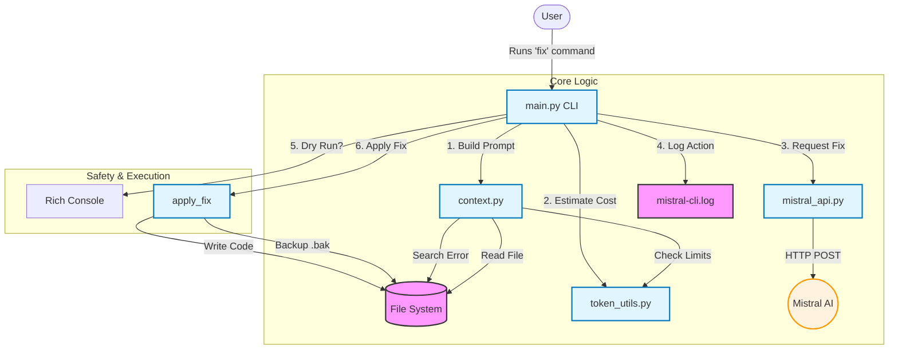

# Mistral CLI - Codebase Walkthrough

This document provides a detailed explanation of the current `mistral-cli` codebase, breaking down each component to help you understand exactly how the tool works.

## Architecture Overview



## 1. Entry Point: `main.py`
This is the heart of the CLI application. It handles user input using **Click** and **Rich** to provide a polished interactive experience.

### Imports & Configuration
```python
import click
from rich.console import Console
from rich.markdown import Markdown
from rich.panel import Panel
import logging
# ...
```
- **`rich`**: Used for colored output, spinners, and markdown rendering.
- **`logging`**: Configured to write execution history to `mistral-cli.log` with timestamps.

### `apply_fix` Function
```python
def apply_fix(file_path, suggestion):
    """Apply the suggested fix to the file, with backup."""
    # ... checks backup ...
    # ... extracts python code ...
    # ... writes file ...
```
- **Purpose**: Safely applies the fix.
- **Safety Mechanisms**:
    1.  **Backup**: Copies the original file to `filename.bak` before any writes.
    2.  **Extraction**: Uses regex to parse content between ```python ... ``` blocks. This ensures only code is written, filtering out conversational text.

### The CLI Interface
```python
@click.group()
def cli(): pass

@cli.command()
@click.option("--dry-run", is_flag=True)
def fix(file, bug_description, dry_run):
    # ... orchestrates the fix ...
```
- **Command Structure**: Uses `click` to define the CLI args.
- **Visuals**: Uses `console.print` and `console.status` (spinner) for user feedback.
- **Token Integation**: Calls `token_utils.count_tokens` to estimate and display usage before the API call.

---

## 2. Context Gathering: `context.py`
This module scans the target file to build a prompt context for the AI.

### `read_relevant_file` & `search_in_file`
- **`read_relevant_file`**: Reads the target file content.
- **`search_in_file`**: Uses pure Python to find lines matching the bug description (Windows-compatible).

### `build_prompt` and Truncation
```python
def build_prompt(file_path, bug_description):
    # ... builds initial prompt ...
    
    # Context Truncation
    if count_tokens(prompt) > 4000:
        file_content = file_content[:truncated_len]
        prompt = construct_final_prompt(...)
```
- **Smart Optimization**: Checks the token count of the generated prompt. If it exceeds 4000 tokens, it automatically truncates the file content to ensure the request fits within the model's context window.

---

## 3. Token Management: `token_utils.py`
A dedicated utility for handling tokenization using `mistral-common`.

```python
def count_tokens(prompt, model="mistral-small"):
    # ... uses MistralTokenizer.v3() ...
    return len(encoded.tokens)
```
- **Global Tokenizer**: Initializes the tokenizer once effectively.
- **Accuracy**: Uses the official Mistral tokenizer to give precise usage estimates.

---

## 4. The Brain: `mistral_api.py`
Handles the raw HTTP communication with the Mistral API. It reads the `MISTRAL_API_KEY` from environment variables and POSTs the chat completion request.

---

## Summary of Current Capabilities
- **Cross-Platform**: Full Windows support (no `grep`).
- **Safety**:
    - Automatic Backups (`.bak`).
    - Smart Code Extraction.
    - Dry Run mode (`--dry-run`).
- **User Experience**:
    - Rich colored output and spinners.
    - Token usage estimation.
    - Logging to `mistral-cli.log`.
- **Optimization**:
    - Automatic context truncation for large files.

## Project Structure
```
mistral-cli/
├── main.py             # CLI Entry point
├── context.py          # Context building & file search
├── mistral_api.py      # API client
├── token_utils.py      # Token counting logic
├── mistral-cli.log     # Execution logs
└── requirements.txt    # Dependencies
```
